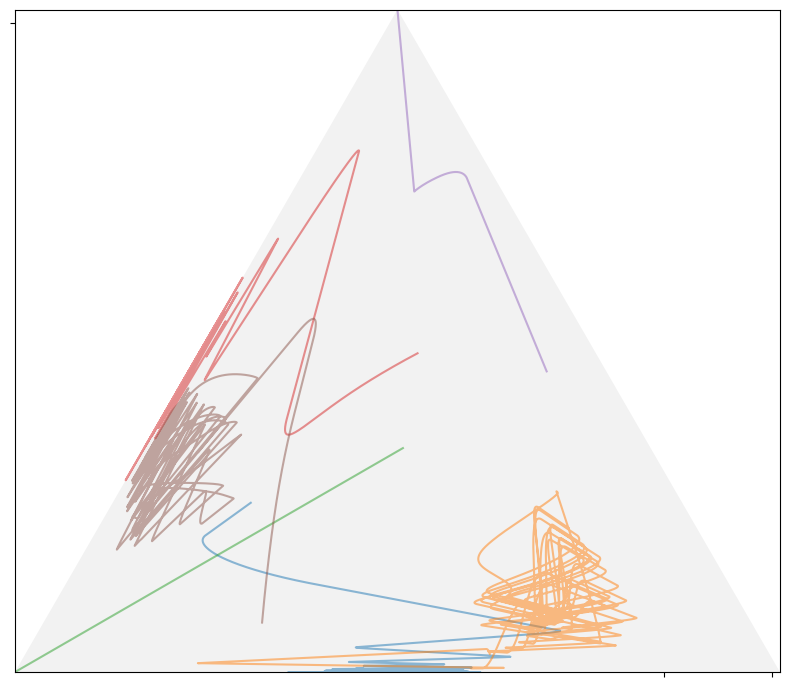

# A path finder for Nash equilibrium

## Overview

This project provides many demo programs to show that the non-cooperative games always converges to Nash equilibrium no matter what initial strategy is given. To run the game, all you have to do is provide payoff matrices (functions) and initial strategies.
The convergence path can be nicely visualized in the 2-D or 3-D graph.

An algorithm called `geometrical regret matching` is the core of this program. More math details are in [this paper](https://doi.org/10.1063/5.0012735).

## Requirements

***

* Python 3
* Python packages: numpy, matplotlib, scikit-learn, nashpy(optional)

Note: Numpy with Openblas support will greatly improves performance. See this [link](https://stackoverflow.com/questions/27199822/numpy-dot-is-slow-yet-blas-and-lapack-are-installed-how-to-fix).

## Demos for two-person games

***
Find the strategy path to Nash equilibrium for a `3X3` game:

```shell
python eqpt_trajectory_3x3.py 3x3_two_eqpt_two_support_2
```

Here ***3x3_two_eqpt_two_support_2*** is the code name of a `3X3` game, whose bimatrix and initial strategies are defined in the python file `games/3x3_two_eqpt_two_support_2.py`. This game has two equilibrium points each of which uses two pure strategies.
The output figure shows that the strategy path goes to one of the equilibrium point dependent on what initial strategies the game starts with:


Note that the red and blue paths belong to different players for the same equilibrium point. And the equilateral triangle in the figure is the transformed simplex:


Or you can run a game with random bimatrix and random initial strategies.

```shell
python eqpt_trajectory_3x3.py 3x3
```

Here game ***3x3*** is defined in `games/3x3.py`. In fact, you can define any game by creating a new Python file in the `games` directory. The following games with self-explanatory file names are predefined (note that those with 'fig_' prefix are for paper usage and should be run by `fig_path_3x3.py`):


You can of course run any general `mXn` game and show the path in 3-D graph. Note that the path of `mXn` dimensions is reduced to `3x3` with PCA. Here is an example of `60X40` game:

```shell
python eqpt_trajectory_PCA_3D.py 60x40
```

Game ***60x40*** is defined in file `games/60x40.py`. Here is the output figure showing the path:


You can run even bigger game, e.g. `games/300x200_two_hour_laptop.py`, which costs less than two hours for a laptop to run.

And equilibrium point can be an 'attractor' for strategy paths, meaning that equilibrium point is the inevitable destination of game regardless where it starts. You can run:

```shell
python tunnel_3x3.py 3x3_two_eqpt_two_support_2
```

The output figure shows that the paths always go to one of the two equilibrium points.


Each time you run the game, there is text output in the terminal showing the details about the equilibrium point and its approximation accuracy.

The accuracy of approximating to a Nash equilibrium point can be visualized by running:

```shell
python eqpt_trajectory_VGS.py 3x3_two_eqpt_two_support_2
```

The output figure is


## Demos for many-person games

You can run many-person game, which usually takes time. The visualization of path is by the command:

```shell
python FPI_nP_path.py
```



The approximation accuracy can visualized by the command:

```shell
python FPI_nP.py
```


## Important: the cyclic strategy path issue

Here we show a big limitation of this "Geometrical Regret Matching" method.

By running the `Shapley's Rock-Paper-Scissor` game among many others, we can observe cyclic strategy paths around the true equilibrium point `(1/3, 1/3, 1/3)`:

```shell
python eqpt_trajectory_3x3_3D.py 3x3_Shapley_RPS
```


The reason for this cycle is that, the regret vector, which is the target of strategy updating, is always to the direction of the border of simplex, because regret vector, no matter how it varies, must have at least one zero component due to the payoff's linearity in mixed strategy.
Therefore, when the regret vector cycles around the simplex border, the mixed strategy chases it and meanwhile struggles for the true equilibrium point in the center of simplex.
Hence, the cycles emerge.

The cyclic strategy paths occur when the game tries to converge to an equilibrium point with more than two pure strategies, and, dependent of the size of cycle, can hurt the approximation accuracy significantly.
